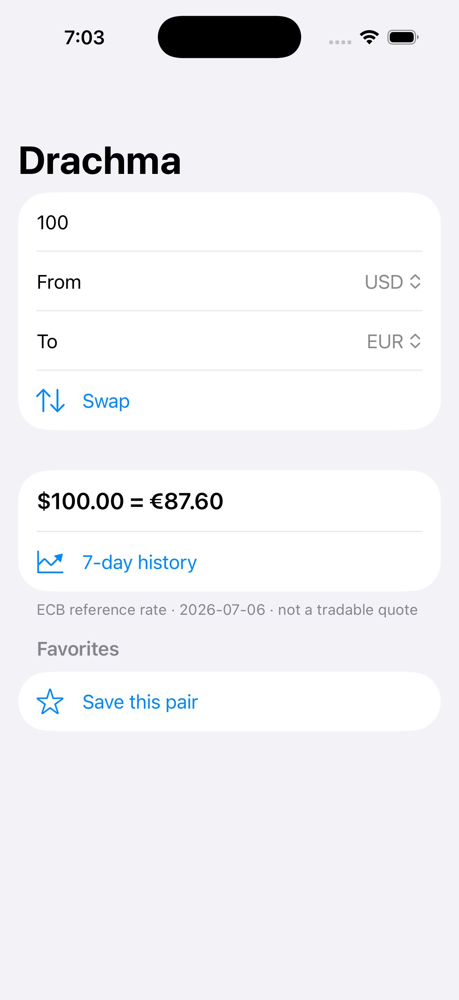
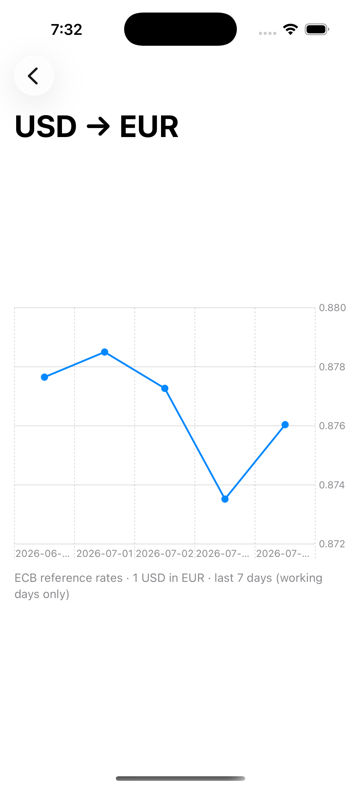
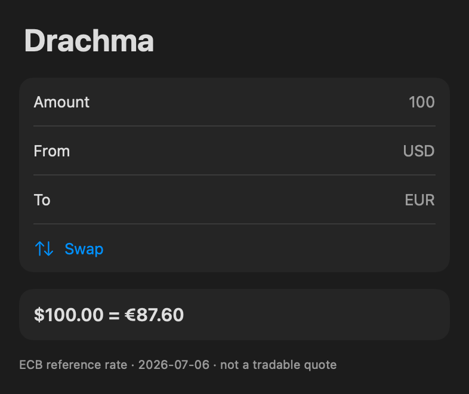
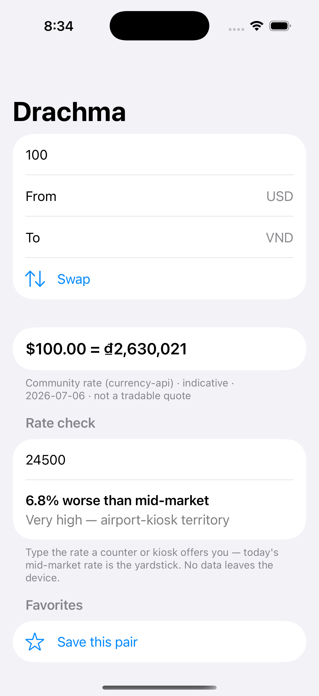
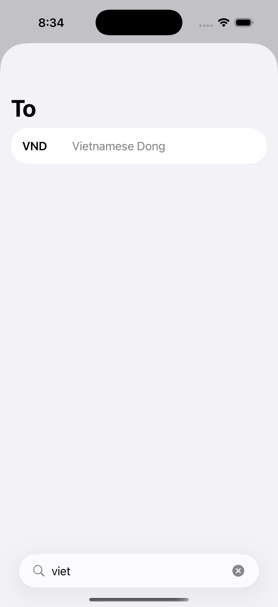
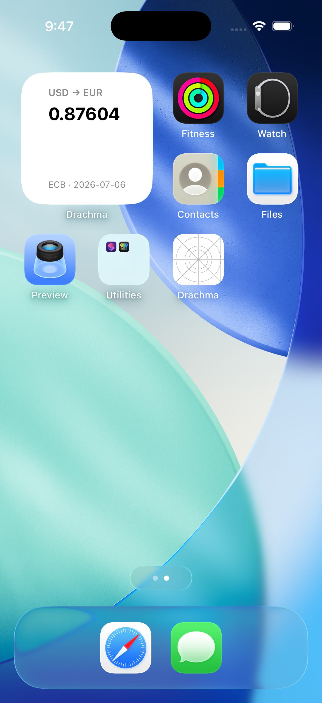

# Drachma


Live currency conversion for humans **and** AI agents — a native iOS app and a Swift MCP server sharing one keyless public data source: the European Central Bank's reference rates, via the [Frankfurter API](https://frankfurter.dev).

No API keys. No accounts. No tracking.

## Manifesto

Exchange rates are public data. Most apps put them behind keys, quotas, ads, and consent walls anyway. Drachma refuses all of it:

- **No ads. Ever.** Not in the free tier, not "removable" ones. An ad that covers your keypad is not a business model.
- **No accounts, no tracking.** A currency converter does not need to know who you are. The code is open, so this claim is auditable — not a privacy-policy promise.
- **Honest rates, timestamped.** Every number shows exactly what it is and how old it is: *"ECB reference rate, Fri 16:00 CET."* These are daily reference rates — great for travel, remittance, and invoicing; not trading quotes. You will never see the word "live" here unless it's true.
- **The free tier is free forever.** The core job — converting money, offline, with your favorite pairs — will never move behind a paywall. Nothing that is free today becomes paid tomorrow.

## Why not just google it?

For a one-off "usd to eur", Google is fine — honestly. Drachma is for the **repeated-use** jobs:

| You are… | Drachma gives you |
|---|---|
| A traveler converting street prices all day | A Home/Lock Screen **widget** pinned to your pair — zero taps — and **offline** cached rates when there's no signal |
| Someone standing at an exchange counter | **Rate check** — type the rate they offered; the mid-market yardstick says how many percent you'd lose, and whether to walk away. No external data, works offline |
| A remitter watching one pair every morning | **Rate alerts** and a history chart, so you send on a good day |
| A cross-border freelancer invoicing monthly | A multi-pair dashboard with paste-friendly, as-you-type conversion |
| An AI agent (Claude, etc.) | The **`drachma-mcp` server** — FX tools inside the conversation, no key to provision |

## The MCP server

`drachma-mcp` is the AI-agent door to the same kitchen. Any MCP-compatible client gets three tools — `convert`, `latest_rates`, `historical_rates` — with zero configuration: nothing to sign up for, no key to paste.

### Try it today (from source)

```sh
git clone https://github.com/sebkoo/drachma && cd drachma
swift build -c release
claude mcp add drachma -- "$PWD/.build/release/drachma-mcp"
```

A Homebrew tap and prebuilt binaries are on the roadmap.

### What the agent sees

A real session, recorded over raw MCP stdio — live data, no mock:

```
→ tools/call convert { "amount": 500000, "from": "KRW", "to": "USD" }
← {
    "amount" : 500000,
    "converted" : 325,
    "from" : "KRW",
    "rateDate" : "2026-07-06",
    "source" : "ECB reference rates via Frankfurter",
    "to" : "USD"
  }
```

Note the `rateDate`: this was recorded early Tuesday (CET), so the ECB reference day is still Monday — the server says so instead of pretending the number is live. That honesty is the product.

## What the human sees

The real app on an iPhone 16 Pro simulator with live data — converter, 7-day history (Swift Charts), and dark mode (rendered from the same view by `swift run render-screenshots`):

<p>



</p>

And the traveler's kit — a community-covered pair with its source named, the rate-check verdict on a kiosk quote, the searchable chooser that finds VND by typing "viet" (or "베트남" on a Korean device), and the widget holding a pair on the Home Screen:

<p>



</p>

The footer line is the manifesto at work: every number carries its date — and its source. Even on the widget.

### Run the app

Open `Drachma.xcodeproj` and hit run — the shell is a thin `@main` around the package's `DrachmaRootView`. The project file is generated: edit `project.yml` and regenerate with [XcodeGen](https://github.com/yonaskolb/XcodeGen) (`xcodegen generate`).

## Layout

```
drachma/
├── DrachmaCore/           # the "M" — one shared Swift package, every surface
│   └── Sources/
│       ├── Models/        #   Rate, CurrencyPair, Money, RatesSnapshot
│       ├── Networking/    #   FrankfurterClient (protocol + URLSession live impl)
│       └── Caching/       #   RatesCache actor — last-good rates + staleness
├── mcp/                   # drachma-mcp executable (MCP Swift SDK, stdio)
├── ios/Drachma/           # SwiftUI app — MVVM-Coordinator
│   ├── App/               #   entry point + composition root
│   ├── Coordinator/       #   Route + AppCoordinator (@Observable router)
│   ├── ViewModels/        #   @Observable view models
│   ├── Views/             #   declarative views; navigation via the coordinator
│   └── Support/           #   EntitlementProviding (free/Pro seam), formatters
└── docs/                  # screenshots, decisions
```

One deliberate choice: the Model layer lives outside the app as a package, so the app, its widgets, and the MCP server consume identical models, networking, and caching. The coordinator starts as a ~30-line router and grows only if flows multiply.

## Pro, and how an open-source app can have one

A paid **Drachma Pro** tier will eventually fund development: unlimited widgets, unlimited rate alerts, long-range history charts, unlimited favorite pairs, and the Apple Watch app. The free tier stays genuinely excellent — see the pledge above.

And because Drachma is fully open source — Pro code included — you can always build it yourself with Xcode and have everything, free. Buying it on the App Store is the convenient path: a signed build, automatic updates, and a way to keep an ad-free, tracker-free converter alive. Both are legitimate. That's the deal.

## Roadmap

- [x] Repo, package scaffold, MVVM-Coordinator layout
- [x] `DrachmaCore`: models + Frankfurter client + tests
- [x] `drachma-mcp`: `convert`, `latest_rates`, `historical_rates` (MCP Swift SDK)
- [x] CI (GitHub Actions): build + test on every push
- [x] iOS app: converter screen, favorite pairs, offline last-good cache with visible timestamps, paste support, dark mode, currency symbols
- [x] Free taste: the 7-day history chart
- [x] Free taste: a configurable rate widget (small/medium — one pair, honestly dated and sourced)
- [ ] Free taste: 1 rate alert
- [ ] App Store release + Drachma Pro (unlimited widgets/alerts/pairs, full charts, Apple Watch)
- [ ] Localization (EU languages first — it's ECB data, after all)
- [ ] An institutional wide-coverage source (IMF representative / UN operational rates) as a third labeled provider behind the same protocol

Issues are the living version of this list.

## The name

The drachma was the money of the ancient Mediterranean. Athens' silver "owl" tetradrachms were struck to one trusted standard and traded far beyond Greece — hoarded from Egypt to Bactria — making them the closest thing antiquity had to a world currency. A fitting emblem for an app whose whole job is moving between currencies. Pronounced **DRAK-ma** (Korean: 드라크마).

## How it's built

Built in the open with [Claude Code](https://claude.com/claude-code) as an AI pair — the same workflow as [Pulse](https://github.com/sebkoo/Pulse): AI-assisted, every line reviewed before it lands. Small, atomic commits; each one builds and tests green.

## Data

Two sources, always labeled — never blended, never hidden:

- **ECB reference rates** via [Frankfurter](https://frankfurter.dev) (keyless) — the official ~30 currencies, published once per working day around 16:00 CET. Weekend numbers are Friday's, and Drachma says so on screen rather than pretending otherwise.
- **Community rates** via [currency-api](https://github.com/fawazahmed0/exchange-api) (keyless, 300+ currencies, daily) — coverage where the ECB doesn't reach (VND, COP, PEN, …). Marked *indicative* wherever they appear.

Pairs the ECB covers get ECB numbers; everything else gets the community source — and the footer under every result names which one you're looking at. Neither is a tradable quote.

## License

MIT — see [LICENSE](LICENSE).
